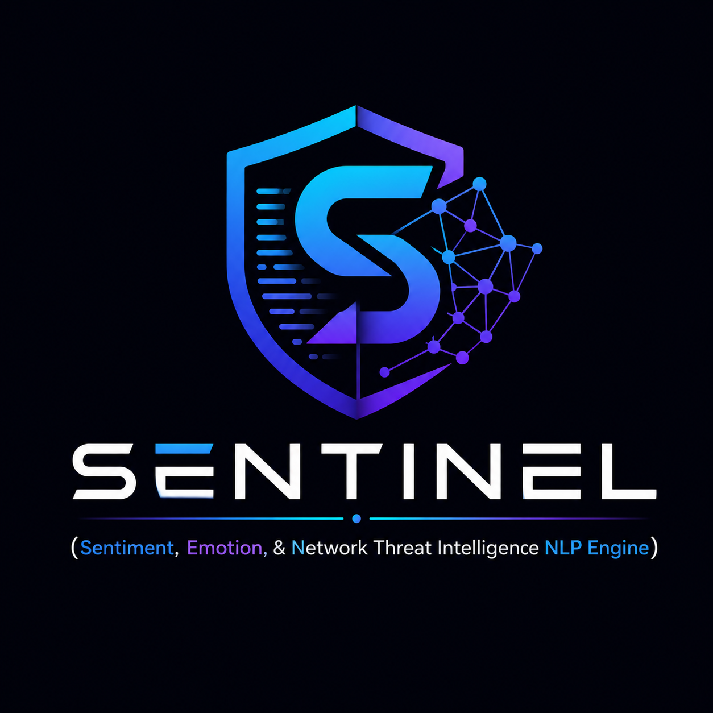

<p align="center">
  
</p>

<h1 align="center">SENTINEL</h1>

<p align="center">
  <strong>Multi-Service Text Intelligence & Security Platform</strong>
</p>

<p align="center">
  A distributed microservice architecture for real-time natural language evaluation, emotion recognition, toxicity detection, spam filtering, and readability scoring.
</p>

---

## Overview

SENTINEL is an enterprise-grade NLP platform designed to evaluate unstructured text across six distinct analytical dimensions simultaneously. Built with a polyglot microservice pattern, the platform orchestrates parallel machine learning inferences in Python, serving processed results through a Node.js Express API gateway backed by MongoDB Atlas.

### Key Capabilities

* **6-Class Emotion Recognition**: Predicts joy, sadness, anger, fear, love, and surprise with complete Softmax confidence probability distributions, trained on 416,809 real-world records.
* **N-Gram Sentiment Analysis**: Binary positive and negative classification using TF-IDF (1,2) n-grams trained on 50,000 IMDB movie reviews (89.67% test accuracy).
* **Toxicity & Threat Detection**: Real-time moderation scanning for offensive language, profanity, and harassment patterns.
* **Spam & Phishing Scanner**: Hybrid regex pattern matching and ML inference for detecting scam presets and malicious URLs.
* **Readability Index**: Automated Flesch-Kincaid reading ease score and grade-level difficulty metrics.
* **Key Term Extraction**: Server-side keyword mining with stop-word filtration.

---

## System Architecture

SENTINEL follows a clean microservice architecture separating machine learning evaluation, API orchestration, data persistence, and user interface layers.

```
┌─────────────────────────────────────────────────────────────────┐
│                    React SPA (Vite + Chart.js)                  │
└────────────────────────────────┬────────────────────────────────┘
                                 │ HTTP / REST
                                 ▼
┌─────────────────────────────────────────────────────────────────┐
│               Express.js API Gateway (Node.js)                   │
└───────────────┬─────────────────────────────────┬───────────────┘
                │ Async Promise.all               │ Mongoose
                ▼                                 ▼
┌───────────────────────────────┐ ┌───────────────────────────────┐
│   Flask ML Microservices      │ │    MongoDB Atlas Database     │
│   (Scikit-Learn / Gunicorn)   │ │  ($facet Aggregation Pipeline)│
└───────────────────────────────┘ └───────────────────────────────┘
```

### Component Breakdown

1. **Python ML Engine (`python_ml/`)**:
   * Multi-endpoint Flask service serving pre-trained Scikit-Learn `.pkl` models.
   * `train_emotion.py`: Fits TF-IDF vectorizer + Logistic Regression on 416K tweet dataset.
   * `train_sentiment.py`: Fits TF-IDF (1,2) vectorizer + Logistic Regression on 50K IMDB reviews.

2. **API Gateway (`backend/`)**:
   * Node.js / Express server managing incoming client payloads.
   * Dispatches parallel `Promise.all` HTTP calls to the Flask ML service to eliminate serial latency.
   * Computes server-side key term frequencies and persists analysis records into MongoDB.
   * Runs MongoDB multi-stage `$facet` aggregation pipelines for real-time analytics.

3. **Frontend Application (`frontend/`)**:
   * React SPA built with Vite, Framer Motion, and Chart.js.
   * Features a sci-fi control room hero visualization, interactive analyzer workspace, and real-time analytics dashboard.

---

## API Specification

### Analysis Endpoint

```http
POST /api/analyze
Content-Type: application/json

{
  "text": "The delivery was surprisingly fast and the customer support was extremely helpful."
}
```

#### Response Structure

```json
{
  "success": true,
  "data": {
    "text": "The delivery was surprisingly fast...",
    "sentiment": "positive",
    "sentimentConfidence": 0.94,
    "emotion": "joy",
    "emotionConfidence": 0.86,
    "emotionScores": {
      "joy": 0.86,
      "surprise": 0.08,
      "sadness": 0.02,
      "anger": 0.02,
      "fear": 0.01,
      "love": 0.01
    },
    "toxic": false,
    "toxicityConfidence": 0.95,
    "isSpam": false,
    "spamConfidence": 0.98,
    "readability": {
      "wordCount": 11,
      "readingEase": 68.5,
      "gradeLevel": "Standard (8th-9th Grade)"
    },
    "keywords": ["delivery", "fast", "customer", "support", "helpful"]
  }
}
```

### Analytics Endpoint

```http
GET /api/stats
```

Returns total submission counts, positive vs. negative ratios, emotion distributions, safety metrics, and top extracted keywords computed via MongoDB `$facet` aggregation.

---

## Local Development Setup

### Prerequisites

* Node.js (v18+)
* Python (v3.9+)
* MongoDB (Local or Atlas connection URI)

### 1. Python ML Microservice

```bash
cd python_ml
pip install -r requirements.txt
python app.py
```
*Service runs on `http://127.0.0.1:5001`*

### 2. Express Backend API Gateway

```bash
cd backend
npm install
npm start
```
*Gateway runs on `http://localhost:5000`*

### 3. Frontend Web Application

```bash
cd frontend
npm install
npm run dev
```
*Application runs on `http://localhost:5173` (or served via Express at `http://localhost:5000`)*

---

## Deployment

The platform is configured for multi-service cloud deployment:

* **Python ML Microservice**: Deployed as a Python Web Service using `gunicorn app:app`.
* **Express Gateway & SPA**: Deployed as a Node Web Service running `node server.js` with `frontend/dist` static file serving.
